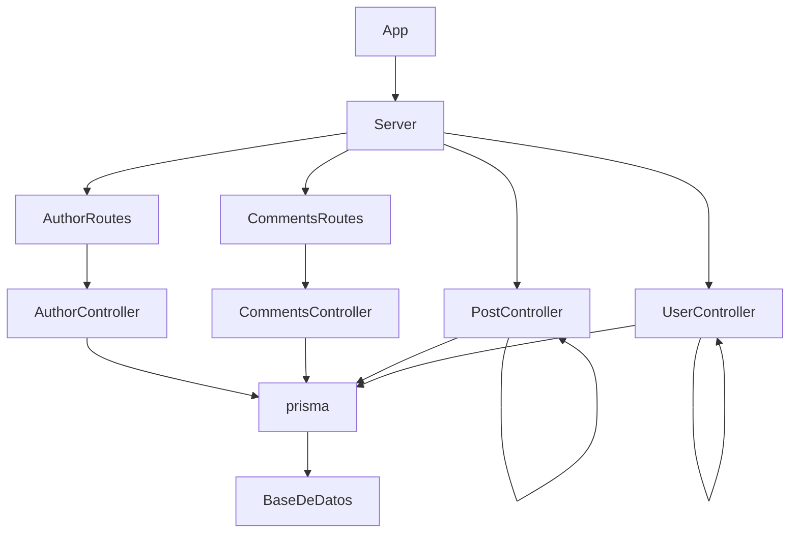

# Evaluación Residencia

Si se desea probar este proyecto no olvide ejecutar el siguiente comando:
-   `npm i`

## Librerias

| Libreria | Comando |
| -------- | ------- |
| [`cors`](https://www.npmjs.com/package/cors) | `npm install cors` |
| [`express`](https://www.npmjs.com/package/express) | `npm install express` |
| [`@prisma/client`](https://www.npmjs.com/package/@prisma/client) | `npm install @prisma/client` |
| [`jest`](https://www.npmjs.com/package/jest) | `npm install jest --save-dev` |
| [`supertest`](https://www.npmjs.com/package/supertest) | `npm install supertest --save-dev` |
| [`ts-jest`](https://www.npmjs.com/package/ts-jest) | `npm install ts-jest --save-dev` |
| [`typescript`](https://www.npmjs.com/package/typescript) | `npm install typescript --save-dev` |
| [`tslint`](https://www.npmjs.com/package/tslint) | `npm install tslint --save-dev` |
| [`prisma`](https://www.npmjs.com/package/prisma) | `npm install prisma --save-dev` |

## La lógica del proyecto

## Endpoints - Para más información consultar el [documento de endpoints](openapi.yml)
| Metodo | Endpoint | Descripción |
| -------- | ----------- | ----------- |
| GET | `/user` | Obtiene los usuarios |
| POST |`/user` | Crea un usuario |
| GET | `/post` | Obtiene los posts dependiendo de los parametros |
| POST | `/post` | Crea un post |
| GET | `/post/:id/comments` | Obtiene los comentarios del post del id especificado |
| POST | `/comments` | Crea un comentario |
| GET | `/author/:id/activities` | Obtiene las actividades del autor del id especificado |

